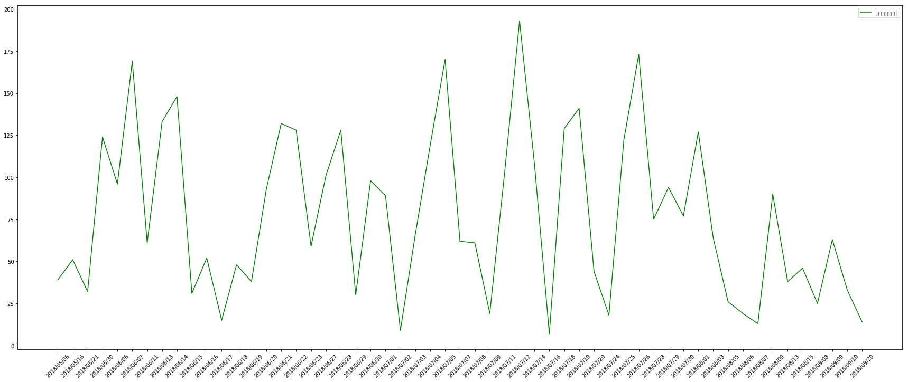

# 戲劇及演員的聲量分析

### 此檔案主要是利用PTT韓劇版的留言，計算近三個月韓劇及韓星的聲量大小

## 1. 匯入需要的套件及讀取自PTT韓劇版上爬下來的json檔


```python
import json

with open("KoreaDrama-2055-2060.json",'r', encoding='utf-8') as f1:
    ptt_kor1 = json.load(f1)
with open("KoreaDrama-2061-2065.json",'r', encoding='utf-8') as f2:
    ptt_kor2 = json.load(f2)
with open("KoreaDrama-2061-2065.json",'r', encoding='utf-8') as f2:
    ptt_kor2 = json.load(f2)
with open("KoreaDrama-2071-2075.json",'r', encoding='utf-8') as f4:
    ptt_kor4 = json.load(f4)   
with open("KoreaDrama-2076-2080.json",'r', encoding='utf-8') as f5:
    ptt_kor5 = json.load(f5)
with open("KoreaDrama-2081-2087.json",'r', encoding='utf-8') as f6:
    ptt_kor6 = json.load(f6)
with open("KoreaDrama-2088-2095.json",'r', encoding='utf-8') as f7:
    ptt_kor7 = json.load(f7)
with open("KoreaDrama-2096-2103.json",'r', encoding='utf-8') as f8:
    ptt_kor8 = json.load(f8)
with open("KoreaDrama-2040-2047.json",'r', encoding='utf-8') as f9:
    ptt_kor9 = json.load(f9)
with open("KoreaDrama-2048-2054.json",'r', encoding='utf-8') as f10:
    ptt_kor10 = json.load(f10)
```


```python
dic_KR=dict(articles= ptt_kor1['articles']+ptt_kor2['articles']+ptt_kor3['articles']+ptt_kor4['articles']+\
            ptt_kor5['articles']+ptt_kor6['articles']+ptt_kor7['articles']+ptt_kor8['articles']+ptt_kor9['articles']+ptt_kor10['articles'])
```


```python
from collections import Counter
from wordcloud import WordCloud
from matplotlib import pyplot as plt
import pandas as pd
import jieba
import matplotlib.pyplot as plt
import operator 
```

## 2. 將json檔轉為DataFrame


```python
article_title_list=[]
date_list=[]
all_count=[]
push_count=[]
boo_count=[]
neutral_count=[]
userid_count=[]
userid_push_count=[]


for i in dic_KR['articles']:
    article_title_list.append(i['article_title'])
    date_list.append(i['date'])
    all_count.append(i['message_count']['all'])
    push_count.append(i['message_count']['push'])
    boo_count.append(i['message_count']['boo'])
    neutral_count.append(i['message_count']['neutral'])
    
    userid=[]
    for j in i['messages']:
        userid.append(j['push_userid'])
    userid_list=list(set(userid))     
    userid_count.append(len(userid_list))
    
    userid_push=[]
    for j in i['messages']:    
        if j['push_tag']=='推':
            userid_push.append(j['push_userid'])
    userid_push_list=list(set(userid_push))         
    userid_push_count.append(len(userid_push_list))
            
```


```python
tbl={
    'article_title':article_title_list,
    'date':date_list,
    'all':all_count,
    'push':push_count,
    'boo':boo_count,
    'neutral':neutral_count,
    'userid_count':userid_count,
    'userid_push_count':userid_push_count 
}

df_tbl=pd.DataFrame(tbl)
```


```python
df_tbl.head()
```


<div>
<style scoped>
    .dataframe tbody tr th:only-of-type {
        vertical-align: middle;
    }

    .dataframe tbody tr th {
        vertical-align: top;
    }

    .dataframe thead th {
        text-align: right;
    }
</style>
<table border="1" class="dataframe">
  <thead>
    <tr style="text-align: right;">
      <th></th>
      <th>article_title</th>
      <th>date</th>
      <th>all</th>
      <th>push</th>
      <th>boo</th>
      <th>neutral</th>
      <th>userid_count</th>
      <th>userid_push_count</th>
    </tr>
  </thead>
  <tbody>
    <tr>
      <th>0</th>
      <td>[心得] 機智的牢房生活-小迷糊的Happen ending</td>
      <td>Mon Jun  4 00:19:02 2018</td>
      <td>43</td>
      <td>31</td>
      <td>0</td>
      <td>12</td>
      <td>33</td>
      <td>31</td>
    </tr>
    <tr>
      <th>1</th>
      <td>[閒聊] 因為張基龍，久違的心動</td>
      <td>Mon Jun  4 05:41:47 2018</td>
      <td>86</td>
      <td>52</td>
      <td>0</td>
      <td>34</td>
      <td>47</td>
      <td>43</td>
    </tr>
    <tr>
      <th>2</th>
      <td>[新聞] 朴施厚X宋智孝 出演《Lovely Horribly》</td>
      <td>Mon Jun  4 14:11:26 2018</td>
      <td>30</td>
      <td>27</td>
      <td>0</td>
      <td>3</td>
      <td>26</td>
      <td>24</td>
    </tr>
    <tr>
      <th>3</th>
      <td>[LIVE] tvN 想停止的瞬間：About Time EP5</td>
      <td>Mon Jun  4 19:38:37 2018</td>
      <td>102</td>
      <td>31</td>
      <td>0</td>
      <td>71</td>
      <td>19</td>
      <td>15</td>
    </tr>
    <tr>
      <th>4</th>
      <td>[LIVE] 檢法男女 EP13、EP14</td>
      <td>Mon Jun  4 20:27:58 2018</td>
      <td>310</td>
      <td>60</td>
      <td>0</td>
      <td>250</td>
      <td>10</td>
      <td>9</td>
    </tr>
  </tbody>
</table>
</div>


```python
def add_int(row):
    if pd.notnull(row['article_title']):
        row['int'] = 1
    else:
        row['int'] = 0
    return row
df_tbl = df_tbl.apply(add_int, axis=1)
```


```python
df_tbl.head()
```


<div>
<style scoped>
    .dataframe tbody tr th:only-of-type {
        vertical-align: middle;
    }

    .dataframe tbody tr th {
        vertical-align: top;
    }

    .dataframe thead th {
        text-align: right;
    }
</style>
<table border="1" class="dataframe">
  <thead>
    <tr style="text-align: right;">
      <th></th>
      <th>article_title</th>
      <th>date</th>
      <th>all</th>
      <th>push</th>
      <th>boo</th>
      <th>neutral</th>
      <th>userid_count</th>
      <th>userid_push_count</th>
      <th>int</th>
    </tr>
  </thead>
  <tbody>
    <tr>
      <th>0</th>
      <td>[心得] 機智的牢房生活-小迷糊的Happen ending</td>
      <td>Mon Jun  4 00:19:02 2018</td>
      <td>43</td>
      <td>31</td>
      <td>0</td>
      <td>12</td>
      <td>33</td>
      <td>31</td>
      <td>1</td>
    </tr>
    <tr>
      <th>1</th>
      <td>[閒聊] 因為張基龍，久違的心動</td>
      <td>Mon Jun  4 05:41:47 2018</td>
      <td>86</td>
      <td>52</td>
      <td>0</td>
      <td>34</td>
      <td>47</td>
      <td>43</td>
      <td>1</td>
    </tr>
    <tr>
      <th>2</th>
      <td>[新聞] 朴施厚X宋智孝 出演《Lovely Horribly》</td>
      <td>Mon Jun  4 14:11:26 2018</td>
      <td>30</td>
      <td>27</td>
      <td>0</td>
      <td>3</td>
      <td>26</td>
      <td>24</td>
      <td>1</td>
    </tr>
    <tr>
      <th>3</th>
      <td>[LIVE] tvN 想停止的瞬間：About Time EP5</td>
      <td>Mon Jun  4 19:38:37 2018</td>
      <td>102</td>
      <td>31</td>
      <td>0</td>
      <td>71</td>
      <td>19</td>
      <td>15</td>
      <td>1</td>
    </tr>
    <tr>
      <th>4</th>
      <td>[LIVE] 檢法男女 EP13、EP14</td>
      <td>Mon Jun  4 20:27:58 2018</td>
      <td>310</td>
      <td>60</td>
      <td>0</td>
      <td>250</td>
      <td>10</td>
      <td>9</td>
      <td>1</td>
    </tr>
  </tbody>
</table>
</div>


## 3. 取出留言的標題及建立韓劇劇名詞庫


```python
article_title_list=df_tbl['article_title'].tolist()
article_title_list[0:10]
```


    ['[心得] 機智的牢房生活-小迷糊的Happen ending',
     '[閒聊] 因為張基龍，久違的心動',
     '[新聞] 朴施厚X宋智孝 出演《Lovely Horribly》',
     '[LIVE] tvN 想停止的瞬間：About Time EP5',
     '[LIVE] 檢法男女 EP13、EP14',
     '[LIVE] SBS 油膩的Melo EP17~18',
     '[LIVE] KBS2 你也是人類嗎? EP1~2',
     '[LIVE] JTBC 漢摩拉比小姐 EP5',
     '[新聞] 《你也是人類嗎》首播收視墊底 《檢法男',
     '[新聞] 千正明有望合作尹恩惠 出演新劇《心動警']


```python
DramaName=pd.read_csv('userdict.csv', encoding='utf-8')
DramaName_list=DramaName['dramaName'].tolist()
DramaName_list[0:10]
```


    ['1006的房客',
     '1006',
     '16個夏天',
     '1989一念間',
     '700歲旅程',
     'A咖的路',
     'High 5 制霸青春',
     'High5 ',
     '制霸青春',
     'HIStory']


## 4. 利用結巴搭配韓劇劇名詞庫，對留言標題進行斷詞


```python
jieba.load_userdict("userdict.txt")
with open('stops.txt', 'r', encoding='utf8') as f:
    stops = f.read().split('\n')

stops.append('\n')
stops.append('\n\n')
```

    Building prefix dict from the default dictionary ...
    Loading model from cache C:\Users\mintz\AppData\Local\Temp\jieba.cache
    Loading model cost 1.069 seconds.
    Prefix dict has been built succesfully.
    


```python
info_all=[]
terms_list=[]

for articleTitle in article_title_list:

    terms = [t for t in jieba.cut_for_search(articleTitle) if t not in stops]
    terms_list.append(terms)
        
    
for term in terms_list:
    title_list=[]
    for i in term:
        if i in DramaName_list:
            title_list.append(i)
    if len(title_list)==0:
        info_all.append('無')
    if len(title_list)>0:
        info_all.append(title_list[0])
```


```python
df_tbl['title']=info_all
df_tbl
```


<div>
<style scoped>
    .dataframe tbody tr th:only-of-type {
        vertical-align: middle;
    }

    .dataframe tbody tr th {
        vertical-align: top;
    }

    .dataframe thead th {
        text-align: right;
    }
</style>
<table border="1" class="dataframe">
  <thead>
    <tr style="text-align: right;">
      <th></th>
      <th>article_title</th>
      <th>date</th>
      <th>all</th>
      <th>push</th>
      <th>boo</th>
      <th>neutral</th>
      <th>userid_count</th>
      <th>userid_push_count</th>
      <th>int</th>
      <th>title</th>
    </tr>
  </thead>
  <tbody>
    <tr>
      <th>0</th>
      <td>[心得] 機智的牢房生活-小迷糊的Happen ending</td>
      <td>Mon Jun  4 00:19:02 2018</td>
      <td>43</td>
      <td>31</td>
      <td>0</td>
      <td>12</td>
      <td>33</td>
      <td>31</td>
      <td>1</td>
      <td>無</td>
    </tr>
    <tr>
      <th>1</th>
      <td>[閒聊] 因為張基龍，久違的心動</td>
      <td>Mon Jun  4 05:41:47 2018</td>
      <td>86</td>
      <td>52</td>
      <td>0</td>
      <td>34</td>
      <td>47</td>
      <td>43</td>
      <td>1</td>
      <td>無</td>
    </tr>
    <tr>
      <th>2</th>
      <td>[新聞] 朴施厚X宋智孝 出演《Lovely Horribly》</td>
      <td>Mon Jun  4 14:11:26 2018</td>
      <td>30</td>
      <td>27</td>
      <td>0</td>
      <td>3</td>
      <td>26</td>
      <td>24</td>
      <td>1</td>
      <td>無</td>
    </tr>
    <tr>
      <th>3</th>
      <td>[LIVE] tvN 想停止的瞬間：About Time EP5</td>
      <td>Mon Jun  4 19:38:37 2018</td>
      <td>102</td>
      <td>31</td>
      <td>0</td>
      <td>71</td>
      <td>19</td>
      <td>15</td>
      <td>1</td>
      <td>想停止的瞬間</td>
    </tr>
    <tr>
      <th>4</th>
      <td>[LIVE] 檢法男女 EP13、EP14</td>
      <td>Mon Jun  4 20:27:58 2018</td>
      <td>310</td>
      <td>60</td>
      <td>0</td>
      <td>250</td>
      <td>10</td>
      <td>9</td>
      <td>1</td>
      <td>檢法男女</td>
    </tr>
    <tr>
      <th>5</th>
      <td>[LIVE] SBS 油膩的Melo EP17~18</td>
      <td>Mon Jun  4 20:29:20 2018</td>
      <td>354</td>
      <td>123</td>
      <td>0</td>
      <td>231</td>
      <td>18</td>
      <td>16</td>
      <td>1</td>
      <td>油膩的</td>
    </tr>
    <tr>
      <th>6</th>
      <td>[LIVE] KBS2 你也是人類嗎? EP1~2</td>
      <td>Mon Jun  4 20:29:58 2018</td>
      <td>98</td>
      <td>70</td>
      <td>0</td>
      <td>28</td>
      <td>32</td>
      <td>29</td>
      <td>1</td>
      <td>你也是人類嗎</td>
    </tr>
    <tr>
      <th>7</th>
      <td>[LIVE] JTBC 漢摩拉比小姐 EP5</td>
      <td>Mon Jun  4 21:07:06 2018</td>
      <td>440</td>
      <td>161</td>
      <td>0</td>
      <td>279</td>
      <td>30</td>
      <td>28</td>
      <td>1</td>
      <td>漢摩拉比小姐</td>
    </tr>
    <tr>
      <th>8</th>
      <td>[新聞] 《你也是人類嗎》首播收視墊底 《檢法男</td>
      <td>Tue Jun  5 11:34:52 2018</td>
      <td>42</td>
      <td>24</td>
      <td>0</td>
      <td>18</td>
      <td>21</td>
      <td>19</td>
      <td>1</td>
      <td>你也是人類嗎</td>
    </tr>
    <tr>
      <th>9</th>
      <td>[新聞] 千正明有望合作尹恩惠 出演新劇《心動警</td>
      <td>Tue Jun  5 11:39:33 2018</td>
      <td>18</td>
      <td>10</td>
      <td>0</td>
      <td>8</td>
      <td>13</td>
      <td>10</td>
      <td>1</td>
      <td>無</td>
    </tr>
    <tr>
      <th>10</th>
      <td>[新聞] 李清娥、洪宗玄確認出演《再一次，春天》</td>
      <td>Tue Jun  5 14:25:53 2018</td>
      <td>30</td>
      <td>20</td>
      <td>0</td>
      <td>10</td>
      <td>25</td>
      <td>20</td>
      <td>1</td>
      <td>無</td>
    </tr>
    <tr>
      <th>11</th>
      <td>[閒聊] 2019年 異夢 : 100年建國大作</td>
      <td>Tue Jun  5 15:24:23 2018</td>
      <td>1</td>
      <td>1</td>
      <td>0</td>
      <td>0</td>
      <td>1</td>
      <td>1</td>
      <td>1</td>
      <td>無</td>
    </tr>
    <tr>
      <th>12</th>
      <td>[新聞] 《一起吃飯吧3》公開劇本練習現場</td>
      <td>Tue Jun  5 15:32:36 2018</td>
      <td>42</td>
      <td>39</td>
      <td>0</td>
      <td>3</td>
      <td>39</td>
      <td>37</td>
      <td>1</td>
      <td>一起吃飯吧</td>
    </tr>
    <tr>
      <th>13</th>
      <td>[LIVE] tvN 想停止的瞬間：About Time EP6</td>
      <td>Tue Jun  5 19:47:46 2018</td>
      <td>167</td>
      <td>67</td>
      <td>0</td>
      <td>100</td>
      <td>33</td>
      <td>30</td>
      <td>1</td>
      <td>想停止的瞬間</td>
    </tr>
    <tr>
      <th>14</th>
      <td>[LIVE] SBS 油膩的Melo EP19~20</td>
      <td>Tue Jun  5 20:35:35 2018</td>
      <td>294</td>
      <td>170</td>
      <td>1</td>
      <td>123</td>
      <td>46</td>
      <td>43</td>
      <td>1</td>
      <td>油膩的</td>
    </tr>
    <tr>
      <th>15</th>
      <td>[LIVE] KBS2 你也是人類嗎? EP3~4</td>
      <td>Tue Jun  5 20:35:58 2018</td>
      <td>193</td>
      <td>107</td>
      <td>0</td>
      <td>86</td>
      <td>25</td>
      <td>20</td>
      <td>1</td>
      <td>你也是人類嗎</td>
    </tr>
    <tr>
      <th>16</th>
      <td>檢法男女EP15.EP16</td>
      <td>Tue Jun  5 20:45:26 2018</td>
      <td>287</td>
      <td>63</td>
      <td>0</td>
      <td>224</td>
      <td>8</td>
      <td>7</td>
      <td>1</td>
      <td>檢法男女</td>
    </tr>
    <tr>
      <th>17</th>
      <td>[LIVE] JTBC 漢摩拉比小姐 EP6</td>
      <td>Tue Jun  5 21:05:17 2018</td>
      <td>588</td>
      <td>233</td>
      <td>0</td>
      <td>355</td>
      <td>51</td>
      <td>48</td>
      <td>1</td>
      <td>漢摩拉比小姐</td>
    </tr>
    <tr>
      <th>18</th>
      <td>[閒聊] 我的大叔之我需解毒啊</td>
      <td>Tue Jun  5 22:39:49 2018</td>
      <td>117</td>
      <td>62</td>
      <td>0</td>
      <td>55</td>
      <td>37</td>
      <td>34</td>
      <td>1</td>
      <td>我的大叔</td>
    </tr>
    <tr>
      <th>19</th>
      <td>[情報] 東森於6/13晚十點播出"名不虛傳"</td>
      <td>Wed Jun  6 13:05:20 2018</td>
      <td>58</td>
      <td>45</td>
      <td>0</td>
      <td>13</td>
      <td>39</td>
      <td>38</td>
      <td>1</td>
      <td>名不虛傳</td>
    </tr>
    <tr>
      <th>20</th>
      <td>[求薦] 監獄類型的片</td>
      <td>Wed Jun  6 17:45:01 2018</td>
      <td>62</td>
      <td>46</td>
      <td>0</td>
      <td>16</td>
      <td>50</td>
      <td>45</td>
      <td>1</td>
      <td>無</td>
    </tr>
    <tr>
      <th>21</th>
      <td>[LIVE] MBC 過來抱抱我 EP13-14（6/7,6/13停播）</td>
      <td>Wed Jun  6 20:06:37 2018</td>
      <td>249</td>
      <td>117</td>
      <td>0</td>
      <td>132</td>
      <td>34</td>
      <td>32</td>
      <td>1</td>
      <td>過來抱抱我</td>
    </tr>
    <tr>
      <th>22</th>
      <td>[LIVE] tvN 金秘書為何那樣 EP1</td>
      <td>Wed Jun  6 20:07:35 2018</td>
      <td>292</td>
      <td>197</td>
      <td>0</td>
      <td>95</td>
      <td>99</td>
      <td>96</td>
      <td>1</td>
      <td>金秘書</td>
    </tr>
    <tr>
      <th>23</th>
      <td>[LIVE] Suits/金裝律師 EP13</td>
      <td>Wed Jun  6 20:35:39 2018</td>
      <td>428</td>
      <td>100</td>
      <td>0</td>
      <td>328</td>
      <td>16</td>
      <td>14</td>
      <td>1</td>
      <td>金裝律師</td>
    </tr>
    <tr>
      <th>24</th>
      <td>[心得] 十八集的live，是誰輕易畫下句點的。</td>
      <td>Wed Jun  6 22:26:34 2018</td>
      <td>58</td>
      <td>51</td>
      <td>0</td>
      <td>7</td>
      <td>50</td>
      <td>49</td>
      <td>1</td>
      <td>無</td>
    </tr>
    <tr>
      <th>25</th>
      <td>[情報] 6月新劇: OCN《Life on Mars》</td>
      <td>Wed Jun  6 22:43:25 2018</td>
      <td>17</td>
      <td>15</td>
      <td>0</td>
      <td>2</td>
      <td>15</td>
      <td>14</td>
      <td>1</td>
      <td>無</td>
    </tr>
    <tr>
      <th>26</th>
      <td>[閒聊] 步步驚心麗_跨越千年的思念</td>
      <td>Thu Jun  7 00:25:53 2018</td>
      <td>96</td>
      <td>47</td>
      <td>0</td>
      <td>49</td>
      <td>38</td>
      <td>36</td>
      <td>1</td>
      <td>無</td>
    </tr>
    <tr>
      <th>27</th>
      <td>[新聞] 《金秘書為何那樣》首播 收視率5.8%起跑</td>
      <td>Thu Jun  7 10:25:24 2018</td>
      <td>71</td>
      <td>62</td>
      <td>0</td>
      <td>9</td>
      <td>60</td>
      <td>56</td>
      <td>1</td>
      <td>金秘書</td>
    </tr>
    <tr>
      <th>28</th>
      <td>[新聞] 《金裝律師》 收視下滑 仍居水木劇冠軍</td>
      <td>Thu Jun  7 11:46:28 2018</td>
      <td>29</td>
      <td>18</td>
      <td>0</td>
      <td>11</td>
      <td>17</td>
      <td>16</td>
      <td>1</td>
      <td>金裝律師</td>
    </tr>
    <tr>
      <th>29</th>
      <td>[情報] 曹承佑、李棟旭《LIFE》二支預告公開</td>
      <td>Thu Jun  7 13:14:15 2018</td>
      <td>78</td>
      <td>63</td>
      <td>0</td>
      <td>15</td>
      <td>59</td>
      <td>54</td>
      <td>1</td>
      <td>LIFE</td>
    </tr>
    <tr>
      <th>...</th>
      <td>...</td>
      <td>...</td>
      <td>...</td>
      <td>...</td>
      <td>...</td>
      <td>...</td>
      <td>...</td>
      <td>...</td>
      <td>...</td>
      <td>...</td>
    </tr>
    <tr>
      <th>1247</th>
      <td>[情報] 6月新劇: KBS《你也是人類嗎?》</td>
      <td>Thu May 31 23:44:24 2018</td>
      <td>88</td>
      <td>51</td>
      <td>0</td>
      <td>37</td>
      <td>34</td>
      <td>31</td>
      <td>1</td>
      <td>你也是人類嗎</td>
    </tr>
    <tr>
      <th>1248</th>
      <td>[新聞] 《金裝律師》收視上升 依舊牢居榜首</td>
      <td>Fri Jun  1 10:49:32 2018</td>
      <td>39</td>
      <td>29</td>
      <td>0</td>
      <td>10</td>
      <td>23</td>
      <td>22</td>
      <td>1</td>
      <td>金裝律師</td>
    </tr>
    <tr>
      <th>1249</th>
      <td>[心得] 檢法男女EP1-EP12-請恩檢不要再黑洞下去</td>
      <td>Fri Jun  1 14:39:54 2018</td>
      <td>35</td>
      <td>12</td>
      <td>0</td>
      <td>23</td>
      <td>12</td>
      <td>10</td>
      <td>1</td>
      <td>檢法男女</td>
    </tr>
    <tr>
      <th>1250</th>
      <td>[心得] 我們遇見的真的是奇蹟嗎？</td>
      <td>Fri Jun  1 14:58:12 2018</td>
      <td>100</td>
      <td>34</td>
      <td>0</td>
      <td>66</td>
      <td>20</td>
      <td>18</td>
      <td>1</td>
      <td>奇蹟</td>
    </tr>
    <tr>
      <th>1251</th>
      <td>Re: [閒聊] 追得很煩躁的voice...</td>
      <td>Fri Jun  1 16:27:20 2018</td>
      <td>48</td>
      <td>18</td>
      <td>0</td>
      <td>30</td>
      <td>14</td>
      <td>13</td>
      <td>1</td>
      <td>無</td>
    </tr>
    <tr>
      <th>1252</th>
      <td>[心得] 訓男正音—有種否極泰來的感覺（雷）</td>
      <td>Fri Jun  1 16:28:28 2018</td>
      <td>86</td>
      <td>48</td>
      <td>0</td>
      <td>38</td>
      <td>36</td>
      <td>31</td>
      <td>1</td>
      <td>無</td>
    </tr>
    <tr>
      <th>1253</th>
      <td>Re: [情報] 不是機器人啊導演版DVD製作調查</td>
      <td>Fri Jun  1 20:45:58 2018</td>
      <td>22</td>
      <td>17</td>
      <td>0</td>
      <td>5</td>
      <td>17</td>
      <td>16</td>
      <td>1</td>
      <td>不是機器人啊</td>
    </tr>
    <tr>
      <th>1254</th>
      <td>[LIVE] 素描 Sketch EP3</td>
      <td>Fri Jun  1 21:13:11 2018</td>
      <td>200</td>
      <td>40</td>
      <td>0</td>
      <td>160</td>
      <td>7</td>
      <td>6</td>
      <td>1</td>
      <td>素描</td>
    </tr>
    <tr>
      <th>1255</th>
      <td>Re: [心得] 經常請吃飯的漂亮姐姐_完結感想</td>
      <td>Sat Jun  2 02:48:09 2018</td>
      <td>48</td>
      <td>43</td>
      <td>0</td>
      <td>5</td>
      <td>43</td>
      <td>43</td>
      <td>1</td>
      <td>經常請吃飯的漂亮姐姐</td>
    </tr>
    <tr>
      <th>1256</th>
      <td>[置底] 6月難以發文討論之「閒聊區」</td>
      <td>Sat Jun  2 08:49:57 2018</td>
      <td>541</td>
      <td>286</td>
      <td>0</td>
      <td>255</td>
      <td>61</td>
      <td>58</td>
      <td>1</td>
      <td>無</td>
    </tr>
    <tr>
      <th>1257</th>
      <td>[閒聊] 有人在看多金社長小資女嗎（有雷）</td>
      <td>Sat Jun  2 10:57:56 2018</td>
      <td>161</td>
      <td>85</td>
      <td>0</td>
      <td>76</td>
      <td>59</td>
      <td>55</td>
      <td>1</td>
      <td>多金社長小資女</td>
    </tr>
    <tr>
      <th>1258</th>
      <td>[閒聊] 金裝律師—有沒有人跟我一樣被嚇到</td>
      <td>Sat Jun  2 12:55:18 2018</td>
      <td>39</td>
      <td>30</td>
      <td>0</td>
      <td>9</td>
      <td>29</td>
      <td>25</td>
      <td>1</td>
      <td>金裝律師</td>
    </tr>
    <tr>
      <th>1259</th>
      <td>[情報] JTBC 漢摩拉比小姐 EP5 預告</td>
      <td>Sat Jun  2 17:52:17 2018</td>
      <td>48</td>
      <td>20</td>
      <td>0</td>
      <td>28</td>
      <td>21</td>
      <td>17</td>
      <td>1</td>
      <td>漢摩拉比小姐</td>
    </tr>
    <tr>
      <th>1260</th>
      <td>[LIVE] tvN《武法律師(無法律師)》EP07</td>
      <td>Sat Jun  2 19:03:56 2018</td>
      <td>302</td>
      <td>161</td>
      <td>0</td>
      <td>141</td>
      <td>29</td>
      <td>28</td>
      <td>1</td>
      <td>武法律師</td>
    </tr>
    <tr>
      <th>1261</th>
      <td>[LIVE] SBS Secret Mother EP13~16</td>
      <td>Sat Jun  2 19:04:43 2018</td>
      <td>17</td>
      <td>12</td>
      <td>0</td>
      <td>5</td>
      <td>10</td>
      <td>9</td>
      <td>1</td>
      <td>Mother</td>
    </tr>
    <tr>
      <th>1262</th>
      <td>[閒聊] 李準基口中的"在伊"張基龍口中的"樂園(轉</td>
      <td>Sat Jun  2 19:54:44 2018</td>
      <td>76</td>
      <td>66</td>
      <td>0</td>
      <td>10</td>
      <td>68</td>
      <td>64</td>
      <td>1</td>
      <td>無</td>
    </tr>
    <tr>
      <th>1263</th>
      <td>[LIVE] OCN 情婦(獵豔情人) EP11</td>
      <td>Sat Jun  2 20:39:28 2018</td>
      <td>49</td>
      <td>9</td>
      <td>0</td>
      <td>40</td>
      <td>10</td>
      <td>8</td>
      <td>1</td>
      <td>情婦</td>
    </tr>
    <tr>
      <th>1264</th>
      <td>[LIVE] 素描 Sketch EP4</td>
      <td>Sat Jun  2 21:14:34 2018</td>
      <td>154</td>
      <td>24</td>
      <td>0</td>
      <td>130</td>
      <td>10</td>
      <td>8</td>
      <td>1</td>
      <td>素描</td>
    </tr>
    <tr>
      <th>1265</th>
      <td>[情報]《局》更名為《Player》宋承憲Krystal合作</td>
      <td>Sat Jun  2 23:17:21 2018</td>
      <td>10</td>
      <td>7</td>
      <td>0</td>
      <td>3</td>
      <td>8</td>
      <td>7</td>
      <td>1</td>
      <td>無</td>
    </tr>
    <tr>
      <th>1266</th>
      <td>[情報] KBS《你也是人類嗎?》開播資訊更新</td>
      <td>Sun Jun  3 00:46:37 2018</td>
      <td>17</td>
      <td>16</td>
      <td>0</td>
      <td>1</td>
      <td>15</td>
      <td>14</td>
      <td>1</td>
      <td>你也是人類嗎</td>
    </tr>
    <tr>
      <th>1267</th>
      <td>[心得] 步步驚心麗 鼓起勇氣才看完的結局</td>
      <td>Sun Jun  3 01:03:24 2018</td>
      <td>213</td>
      <td>120</td>
      <td>0</td>
      <td>93</td>
      <td>85</td>
      <td>82</td>
      <td>1</td>
      <td>無</td>
    </tr>
    <tr>
      <th>1268</th>
      <td>[心得] 差點就錯過的好劇「過來抱抱我」（有雷）</td>
      <td>Sun Jun  3 13:38:40 2018</td>
      <td>140</td>
      <td>56</td>
      <td>0</td>
      <td>84</td>
      <td>42</td>
      <td>39</td>
      <td>1</td>
      <td>過來抱抱我</td>
    </tr>
    <tr>
      <th>1269</th>
      <td>[心得] 想停止的瞬間 很好看啊~</td>
      <td>Sun Jun  3 16:41:44 2018</td>
      <td>106</td>
      <td>61</td>
      <td>0</td>
      <td>45</td>
      <td>56</td>
      <td>51</td>
      <td>1</td>
      <td>想停止的瞬間</td>
    </tr>
    <tr>
      <th>1270</th>
      <td>[LIVE] tvN《武法律師(無法律師)》EP08</td>
      <td>Sun Jun  3 19:03:49 2018</td>
      <td>492</td>
      <td>217</td>
      <td>1</td>
      <td>274</td>
      <td>66</td>
      <td>61</td>
      <td>1</td>
      <td>武法律師</td>
    </tr>
    <tr>
      <th>1271</th>
      <td>[心得] 我的大叔 雜感</td>
      <td>Sun Jun  3 20:23:14 2018</td>
      <td>67</td>
      <td>29</td>
      <td>0</td>
      <td>38</td>
      <td>24</td>
      <td>22</td>
      <td>1</td>
      <td>我的大叔</td>
    </tr>
    <tr>
      <th>1272</th>
      <td>[心得] 漢摩拉比小姐：帶頭衝撞體制是困難的</td>
      <td>Sun Jun  3 20:25:37 2018</td>
      <td>342</td>
      <td>122</td>
      <td>0</td>
      <td>220</td>
      <td>46</td>
      <td>44</td>
      <td>1</td>
      <td>漢摩拉比小姐</td>
    </tr>
    <tr>
      <th>1273</th>
      <td>[LIVE] OCN 情婦(獵豔情人) EP12 完結篇</td>
      <td>Sun Jun  3 20:29:36 2018</td>
      <td>256</td>
      <td>52</td>
      <td>0</td>
      <td>204</td>
      <td>29</td>
      <td>25</td>
      <td>1</td>
      <td>情婦</td>
    </tr>
    <tr>
      <th>1274</th>
      <td>[心得] 機智的牢房生活-小迷糊的Happen ending</td>
      <td>Mon Jun  4 00:19:02 2018</td>
      <td>43</td>
      <td>31</td>
      <td>0</td>
      <td>12</td>
      <td>33</td>
      <td>31</td>
      <td>1</td>
      <td>無</td>
    </tr>
    <tr>
      <th>1275</th>
      <td>[閒聊] 因為張基龍，久違的心動</td>
      <td>Mon Jun  4 05:41:47 2018</td>
      <td>86</td>
      <td>52</td>
      <td>0</td>
      <td>34</td>
      <td>47</td>
      <td>43</td>
      <td>1</td>
      <td>無</td>
    </tr>
    <tr>
      <th>1276</th>
      <td>[新聞] 朴施厚X宋智孝 出演《Lovely Horribly》</td>
      <td>Mon Jun  4 14:11:26 2018</td>
      <td>30</td>
      <td>27</td>
      <td>0</td>
      <td>3</td>
      <td>26</td>
      <td>24</td>
      <td>1</td>
      <td>無</td>
    </tr>
  </tbody>
</table>
<p>1277 rows × 10 columns</p>
</div>


```python
df_kor=df_tbl.replace(['武法律師', '油膩的', '金秘書', '你的管家', 'Sunshine', 'Mr.Sunshine', '一起吃飯吧', '江南美人', 'Signal', 'abouttime', '客'], \
               ['無法律師', '油膩的Melo', '金秘書為何那樣', '妳的管家','陽光先生', '陽光先生', '一起吃飯吧3', '我的ID是江南美人', '信號', '想停止的瞬間', 'The Guest'])
```


```python
df_kor.to_csv('df_kor_drama.csv', encoding='utf-8')
df_kor.head()
```


<div>
<style scoped>
    .dataframe tbody tr th:only-of-type {
        vertical-align: middle;
    }

    .dataframe tbody tr th {
        vertical-align: top;
    }

    .dataframe thead th {
        text-align: right;
    }
</style>
<table border="1" class="dataframe">
  <thead>
    <tr style="text-align: right;">
      <th></th>
      <th>article_title</th>
      <th>date</th>
      <th>all</th>
      <th>push</th>
      <th>boo</th>
      <th>neutral</th>
      <th>userid_count</th>
      <th>userid_push_count</th>
      <th>int</th>
      <th>title</th>
    </tr>
  </thead>
  <tbody>
    <tr>
      <th>0</th>
      <td>[心得] 機智的牢房生活-小迷糊的Happen ending</td>
      <td>Mon Jun  4 00:19:02 2018</td>
      <td>43</td>
      <td>31</td>
      <td>0</td>
      <td>12</td>
      <td>33</td>
      <td>31</td>
      <td>1</td>
      <td>無</td>
    </tr>
    <tr>
      <th>1</th>
      <td>[閒聊] 因為張基龍，久違的心動</td>
      <td>Mon Jun  4 05:41:47 2018</td>
      <td>86</td>
      <td>52</td>
      <td>0</td>
      <td>34</td>
      <td>47</td>
      <td>43</td>
      <td>1</td>
      <td>無</td>
    </tr>
    <tr>
      <th>2</th>
      <td>[新聞] 朴施厚X宋智孝 出演《Lovely Horribly》</td>
      <td>Mon Jun  4 14:11:26 2018</td>
      <td>30</td>
      <td>27</td>
      <td>0</td>
      <td>3</td>
      <td>26</td>
      <td>24</td>
      <td>1</td>
      <td>無</td>
    </tr>
    <tr>
      <th>3</th>
      <td>[LIVE] tvN 想停止的瞬間：About Time EP5</td>
      <td>Mon Jun  4 19:38:37 2018</td>
      <td>102</td>
      <td>31</td>
      <td>0</td>
      <td>71</td>
      <td>19</td>
      <td>15</td>
      <td>1</td>
      <td>想停止的瞬間</td>
    </tr>
    <tr>
      <th>4</th>
      <td>[LIVE] 檢法男女 EP13、EP14</td>
      <td>Mon Jun  4 20:27:58 2018</td>
      <td>310</td>
      <td>60</td>
      <td>0</td>
      <td>250</td>
      <td>10</td>
      <td>9</td>
      <td>1</td>
      <td>檢法男女</td>
    </tr>
  </tbody>
</table>
</div>


## 5. 整理可判斷出戲劇劇名的留言，並且處理留言時間欄位


```python
df_kor_withTitle=df_kor[df_kor['title']!='無']
```


```python
df_list=df_kor_withTitle['date'].tolist()

month_list=[]
day_list=[]
year_list=[]
for i in df_list:
    year_list.append(i.split()[4])
    month_list.append(i.split()[1])
    day_list.append(i.split()[2])
```


```python
df_kor_withTitle['year']=year_list
df_kor_withTitle['month']=month_list
df_kor_withTitle['day']=day_list
df_kor_withTitle1=df_kor_withTitle.replace(['May','Jun', 'Jul', 'Aug','Sep', '1', '2', '3','4', '5', '6', '7', '8', '9'], \
                                           ['5','6', '7', '8','9','01', '02', '03', '04', '05', '06', '07', '08', '09'])
df_kor_withTitle1['date1']=df_kor_withTitle1['year']+'/'+df_kor_withTitle1['month']+'/'+df_kor_withTitle1['day']
df_kor_withTitle1.to_csv('df_kor_drama_date.csv', encoding='utf-8')
df_kor_withTitle1.head(10)
```

    C:\Anaconda3\lib\site-packages\ipykernel_launcher.py:1: SettingWithCopyWarning: 
    A value is trying to be set on a copy of a slice from a DataFrame.
    Try using .loc[row_indexer,col_indexer] = value instead
    
    See the caveats in the documentation: http://pandas.pydata.org/pandas-docs/stable/indexing.html#indexing-view-versus-copy
      """Entry point for launching an IPython kernel.
    C:\Anaconda3\lib\site-packages\ipykernel_launcher.py:2: SettingWithCopyWarning: 
    A value is trying to be set on a copy of a slice from a DataFrame.
    Try using .loc[row_indexer,col_indexer] = value instead
    
    See the caveats in the documentation: http://pandas.pydata.org/pandas-docs/stable/indexing.html#indexing-view-versus-copy
      
    C:\Anaconda3\lib\site-packages\ipykernel_launcher.py:3: SettingWithCopyWarning: 
    A value is trying to be set on a copy of a slice from a DataFrame.
    Try using .loc[row_indexer,col_indexer] = value instead
    
    See the caveats in the documentation: http://pandas.pydata.org/pandas-docs/stable/indexing.html#indexing-view-versus-copy
      This is separate from the ipykernel package so we can avoid doing imports until
    


<div>
<style scoped>
    .dataframe tbody tr th:only-of-type {
        vertical-align: middle;
    }

    .dataframe tbody tr th {
        vertical-align: top;
    }

    .dataframe thead th {
        text-align: right;
    }
</style>
<table border="1" class="dataframe">
  <thead>
    <tr style="text-align: right;">
      <th></th>
      <th>article_title</th>
      <th>date</th>
      <th>all</th>
      <th>push</th>
      <th>boo</th>
      <th>neutral</th>
      <th>userid_count</th>
      <th>userid_push_count</th>
      <th>int</th>
      <th>title</th>
      <th>year</th>
      <th>month</th>
      <th>day</th>
      <th>date1</th>
    </tr>
  </thead>
  <tbody>
    <tr>
      <th>3</th>
      <td>[LIVE] tvN 想停止的瞬間：About Time EP5</td>
      <td>Mon Jun  4 19:38:37 2018</td>
      <td>102</td>
      <td>31</td>
      <td>0</td>
      <td>71</td>
      <td>19</td>
      <td>15</td>
      <td>1</td>
      <td>想停止的瞬間</td>
      <td>2018</td>
      <td>06</td>
      <td>04</td>
      <td>2018/06/04</td>
    </tr>
    <tr>
      <th>4</th>
      <td>[LIVE] 檢法男女 EP13、EP14</td>
      <td>Mon Jun  4 20:27:58 2018</td>
      <td>310</td>
      <td>60</td>
      <td>0</td>
      <td>250</td>
      <td>10</td>
      <td>9</td>
      <td>1</td>
      <td>檢法男女</td>
      <td>2018</td>
      <td>06</td>
      <td>04</td>
      <td>2018/06/04</td>
    </tr>
    <tr>
      <th>5</th>
      <td>[LIVE] SBS 油膩的Melo EP17~18</td>
      <td>Mon Jun  4 20:29:20 2018</td>
      <td>354</td>
      <td>123</td>
      <td>0</td>
      <td>231</td>
      <td>18</td>
      <td>16</td>
      <td>1</td>
      <td>油膩的Melo</td>
      <td>2018</td>
      <td>06</td>
      <td>04</td>
      <td>2018/06/04</td>
    </tr>
    <tr>
      <th>6</th>
      <td>[LIVE] KBS2 你也是人類嗎? EP1~2</td>
      <td>Mon Jun  4 20:29:58 2018</td>
      <td>98</td>
      <td>70</td>
      <td>0</td>
      <td>28</td>
      <td>32</td>
      <td>29</td>
      <td>1</td>
      <td>你也是人類嗎</td>
      <td>2018</td>
      <td>06</td>
      <td>04</td>
      <td>2018/06/04</td>
    </tr>
    <tr>
      <th>7</th>
      <td>[LIVE] JTBC 漢摩拉比小姐 EP5</td>
      <td>Mon Jun  4 21:07:06 2018</td>
      <td>440</td>
      <td>161</td>
      <td>0</td>
      <td>279</td>
      <td>30</td>
      <td>28</td>
      <td>1</td>
      <td>漢摩拉比小姐</td>
      <td>2018</td>
      <td>06</td>
      <td>04</td>
      <td>2018/06/04</td>
    </tr>
    <tr>
      <th>8</th>
      <td>[新聞] 《你也是人類嗎》首播收視墊底 《檢法男</td>
      <td>Tue Jun  5 11:34:52 2018</td>
      <td>42</td>
      <td>24</td>
      <td>0</td>
      <td>18</td>
      <td>21</td>
      <td>19</td>
      <td>1</td>
      <td>你也是人類嗎</td>
      <td>2018</td>
      <td>06</td>
      <td>05</td>
      <td>2018/06/05</td>
    </tr>
    <tr>
      <th>12</th>
      <td>[新聞] 《一起吃飯吧3》公開劇本練習現場</td>
      <td>Tue Jun  5 15:32:36 2018</td>
      <td>42</td>
      <td>39</td>
      <td>0</td>
      <td>3</td>
      <td>39</td>
      <td>37</td>
      <td>1</td>
      <td>一起吃飯吧3</td>
      <td>2018</td>
      <td>06</td>
      <td>05</td>
      <td>2018/06/05</td>
    </tr>
    <tr>
      <th>13</th>
      <td>[LIVE] tvN 想停止的瞬間：About Time EP6</td>
      <td>Tue Jun  5 19:47:46 2018</td>
      <td>167</td>
      <td>67</td>
      <td>0</td>
      <td>100</td>
      <td>33</td>
      <td>30</td>
      <td>1</td>
      <td>想停止的瞬間</td>
      <td>2018</td>
      <td>06</td>
      <td>05</td>
      <td>2018/06/05</td>
    </tr>
    <tr>
      <th>14</th>
      <td>[LIVE] SBS 油膩的Melo EP19~20</td>
      <td>Tue Jun  5 20:35:35 2018</td>
      <td>294</td>
      <td>170</td>
      <td>1</td>
      <td>123</td>
      <td>46</td>
      <td>43</td>
      <td>1</td>
      <td>油膩的Melo</td>
      <td>2018</td>
      <td>06</td>
      <td>05</td>
      <td>2018/06/05</td>
    </tr>
    <tr>
      <th>15</th>
      <td>[LIVE] KBS2 你也是人類嗎? EP3~4</td>
      <td>Tue Jun  5 20:35:58 2018</td>
      <td>193</td>
      <td>107</td>
      <td>0</td>
      <td>86</td>
      <td>25</td>
      <td>20</td>
      <td>1</td>
      <td>你也是人類嗎</td>
      <td>2018</td>
      <td>06</td>
      <td>05</td>
      <td>2018/06/05</td>
    </tr>
  </tbody>
</table>
</div>


```python
df_kor1=df_kor_withTitle1.groupby(['title']).sum().sort_values('userid_push_count', ascending=False)
df_kor1.head()
```


<div>
<style scoped>
    .dataframe tbody tr th:only-of-type {
        vertical-align: middle;
    }

    .dataframe tbody tr th {
        vertical-align: top;
    }

    .dataframe thead th {
        text-align: right;
    }
</style>
<table border="1" class="dataframe">
  <thead>
    <tr style="text-align: right;">
      <th></th>
      <th>all</th>
      <th>push</th>
      <th>boo</th>
      <th>neutral</th>
      <th>userid_count</th>
      <th>userid_push_count</th>
      <th>int</th>
    </tr>
    <tr>
      <th>title</th>
      <th></th>
      <th></th>
      <th></th>
      <th></th>
      <th></th>
      <th></th>
      <th></th>
    </tr>
  </thead>
  <tbody>
    <tr>
      <th>金秘書為何那樣</th>
      <td>14846</td>
      <td>9143</td>
      <td>4</td>
      <td>5699</td>
      <td>4482</td>
      <td>4243</td>
      <td>77</td>
    </tr>
    <tr>
      <th>我的ID是江南美人</th>
      <td>9149</td>
      <td>4937</td>
      <td>2</td>
      <td>4210</td>
      <td>2604</td>
      <td>2467</td>
      <td>40</td>
    </tr>
    <tr>
      <th>我的大叔</th>
      <td>5869</td>
      <td>3120</td>
      <td>10</td>
      <td>2739</td>
      <td>1934</td>
      <td>1813</td>
      <td>54</td>
    </tr>
    <tr>
      <th>陽光先生</th>
      <td>11464</td>
      <td>5003</td>
      <td>5</td>
      <td>6456</td>
      <td>1583</td>
      <td>1418</td>
      <td>50</td>
    </tr>
    <tr>
      <th>雖然30但仍17</th>
      <td>6666</td>
      <td>2842</td>
      <td>0</td>
      <td>3824</td>
      <td>1390</td>
      <td>1320</td>
      <td>41</td>
    </tr>
  </tbody>
</table>
</div>


```python
df_kor1_drama_r=df_kor1.reset_index()
df_kor1_drama_r.to_csv('df_kor_drama_r.csv', encoding='utf-8')
df_kor1_drama_r.head()
```


<div>
<style scoped>
    .dataframe tbody tr th:only-of-type {
        vertical-align: middle;
    }

    .dataframe tbody tr th {
        vertical-align: top;
    }

    .dataframe thead th {
        text-align: right;
    }
</style>
<table border="1" class="dataframe">
  <thead>
    <tr style="text-align: right;">
      <th></th>
      <th>title</th>
      <th>all</th>
      <th>push</th>
      <th>boo</th>
      <th>neutral</th>
      <th>userid_count</th>
      <th>userid_push_count</th>
      <th>int</th>
    </tr>
  </thead>
  <tbody>
    <tr>
      <th>0</th>
      <td>金秘書為何那樣</td>
      <td>14846</td>
      <td>9143</td>
      <td>4</td>
      <td>5699</td>
      <td>4482</td>
      <td>4243</td>
      <td>77</td>
    </tr>
    <tr>
      <th>1</th>
      <td>我的ID是江南美人</td>
      <td>9149</td>
      <td>4937</td>
      <td>2</td>
      <td>4210</td>
      <td>2604</td>
      <td>2467</td>
      <td>40</td>
    </tr>
    <tr>
      <th>2</th>
      <td>我的大叔</td>
      <td>5869</td>
      <td>3120</td>
      <td>10</td>
      <td>2739</td>
      <td>1934</td>
      <td>1813</td>
      <td>54</td>
    </tr>
    <tr>
      <th>3</th>
      <td>陽光先生</td>
      <td>11464</td>
      <td>5003</td>
      <td>5</td>
      <td>6456</td>
      <td>1583</td>
      <td>1418</td>
      <td>50</td>
    </tr>
    <tr>
      <th>4</th>
      <td>雖然30但仍17</td>
      <td>6666</td>
      <td>2842</td>
      <td>0</td>
      <td>3824</td>
      <td>1390</td>
      <td>1320</td>
      <td>41</td>
    </tr>
  </tbody>
</table>
</div>


## 6. 畫出某部戲劇的聲量時間序列


```python
d2=df_kor_withTitle1.groupby(['title', 'date1']).sum()
d3=d2.reset_index()
d4=d3.sort_values(['title', 'date1'])
plt.figure(figsize=(30,12))
plt.xticks(rotation=45)

dramaName='金秘書為何那樣'
d5 = d4[d4['title'] == dramaName]
plt.plot(d5['date1'], d5["userid_push_count"], color='green', label=dramaName)


plt.legend()
plt.show()
```





```python
d4.to_csv('df_kor_drama_title_date.csv', encoding='utf-8')
```

## 7. 製作戲劇聲量雲


```python
dic_kor={}
df_kor2=df_kor1.reset_index()
df_title=df_kor2['title'].tolist()
df_num=df_kor2['userid_push_count'].tolist()

for i in range(len(df_num)):
    dic_kor[df_title[i]]=df_num[i]

kor_list=[]  
for i in df_title:
    tu=(i, dic_kor[i])
    kor_list.append(tu)

kor_list[0:3]
```


    [('金秘書為何那樣', 4243), ('我的ID是江南美人', 2467), ('我的大叔', 1813)]


```python
kor_cloud=[]

for i in range(len(df_num)):
    for j in range(df_num[i]):
        kor_cloud.append(df_title[i])
```


```python
wordcloud = WordCloud(font_path='SimSun.ttf')
# wl_space_split = ",".join(kor_cloud)
wordcloud.generate_from_frequencies(frequencies=Counter(kor_cloud))
# my_wordcloud = wc.generate(wl_space_split)
plt.figure(figsize=(15,15))
plt.imshow(wordcloud, interpolation="bilinear")
plt.axis("off")
plt.show()
```


## 8. 建立韓劇演員詞庫


```python
ActorName=pd.read_csv('userdict2.csv', encoding='utf-8')
ActorName_list=ActorName['actorName'].tolist()
ActorName_list[0:3]
```


    ['李英愛', '宋承憲', '吳允兒']


## 9. 利用結巴搭配韓劇演員詞庫，對留言標題進行斷詞


```python
jieba.load_userdict("userdict2.txt")
with open('stops.txt', 'r', encoding='utf8') as f:
    stops = f.read().split('\n')

stops.append('\n')
stops.append('\n\n')
```


```python
info_all_a=[]
terms_list_a=[]

for articleTitle in article_title_list:

    terms_a = [t for t in jieba.cut_for_search(articleTitle) if t not in stops]
    terms_list_a.append(terms_a)
        
    
for term in terms_list_a:
    title_list_a=[]
    for i in term:
        if i in ActorName_list:
            title_list_a.append(i)
    if len(title_list_a)==0:
        info_all_a.append('無')
    if len(title_list_a)>0:
        info_all_a.append(title_list_a[0])
```


```python
df_tbl['actor']=info_all_a
df_tbl.to_csv('df_kor_actor.csv', encoding='utf-8')
df_kor_a=df_tbl
df_kor_a
```


<div>
<style scoped>
    .dataframe tbody tr th:only-of-type {
        vertical-align: middle;
    }

    .dataframe tbody tr th {
        vertical-align: top;
    }

    .dataframe thead th {
        text-align: right;
    }
</style>
<table border="1" class="dataframe">
  <thead>
    <tr style="text-align: right;">
      <th></th>
      <th>article_title</th>
      <th>date</th>
      <th>all</th>
      <th>push</th>
      <th>boo</th>
      <th>neutral</th>
      <th>userid_count</th>
      <th>userid_push_count</th>
      <th>int</th>
      <th>title</th>
      <th>actor</th>
    </tr>
  </thead>
  <tbody>
    <tr>
      <th>0</th>
      <td>[心得] 機智的牢房生活-小迷糊的Happen ending</td>
      <td>Mon Jun  4 00:19:02 2018</td>
      <td>43</td>
      <td>31</td>
      <td>0</td>
      <td>12</td>
      <td>33</td>
      <td>31</td>
      <td>1</td>
      <td>無</td>
      <td>無</td>
    </tr>
    <tr>
      <th>1</th>
      <td>[閒聊] 因為張基龍，久違的心動</td>
      <td>Mon Jun  4 05:41:47 2018</td>
      <td>86</td>
      <td>52</td>
      <td>0</td>
      <td>34</td>
      <td>47</td>
      <td>43</td>
      <td>1</td>
      <td>無</td>
      <td>張基龍</td>
    </tr>
    <tr>
      <th>2</th>
      <td>[新聞] 朴施厚X宋智孝 出演《Lovely Horribly》</td>
      <td>Mon Jun  4 14:11:26 2018</td>
      <td>30</td>
      <td>27</td>
      <td>0</td>
      <td>3</td>
      <td>26</td>
      <td>24</td>
      <td>1</td>
      <td>無</td>
      <td>朴施厚</td>
    </tr>
    <tr>
      <th>3</th>
      <td>[LIVE] tvN 想停止的瞬間：About Time EP5</td>
      <td>Mon Jun  4 19:38:37 2018</td>
      <td>102</td>
      <td>31</td>
      <td>0</td>
      <td>71</td>
      <td>19</td>
      <td>15</td>
      <td>1</td>
      <td>想停止的瞬間</td>
      <td>無</td>
    </tr>
    <tr>
      <th>4</th>
      <td>[LIVE] 檢法男女 EP13、EP14</td>
      <td>Mon Jun  4 20:27:58 2018</td>
      <td>310</td>
      <td>60</td>
      <td>0</td>
      <td>250</td>
      <td>10</td>
      <td>9</td>
      <td>1</td>
      <td>檢法男女</td>
      <td>無</td>
    </tr>
    <tr>
      <th>5</th>
      <td>[LIVE] SBS 油膩的Melo EP17~18</td>
      <td>Mon Jun  4 20:29:20 2018</td>
      <td>354</td>
      <td>123</td>
      <td>0</td>
      <td>231</td>
      <td>18</td>
      <td>16</td>
      <td>1</td>
      <td>油膩的</td>
      <td>無</td>
    </tr>
    <tr>
      <th>6</th>
      <td>[LIVE] KBS2 你也是人類嗎? EP1~2</td>
      <td>Mon Jun  4 20:29:58 2018</td>
      <td>98</td>
      <td>70</td>
      <td>0</td>
      <td>28</td>
      <td>32</td>
      <td>29</td>
      <td>1</td>
      <td>你也是人類嗎</td>
      <td>無</td>
    </tr>
    <tr>
      <th>7</th>
      <td>[LIVE] JTBC 漢摩拉比小姐 EP5</td>
      <td>Mon Jun  4 21:07:06 2018</td>
      <td>440</td>
      <td>161</td>
      <td>0</td>
      <td>279</td>
      <td>30</td>
      <td>28</td>
      <td>1</td>
      <td>漢摩拉比小姐</td>
      <td>無</td>
    </tr>
    <tr>
      <th>8</th>
      <td>[新聞] 《你也是人類嗎》首播收視墊底 《檢法男</td>
      <td>Tue Jun  5 11:34:52 2018</td>
      <td>42</td>
      <td>24</td>
      <td>0</td>
      <td>18</td>
      <td>21</td>
      <td>19</td>
      <td>1</td>
      <td>你也是人類嗎</td>
      <td>無</td>
    </tr>
    <tr>
      <th>9</th>
      <td>[新聞] 千正明有望合作尹恩惠 出演新劇《心動警</td>
      <td>Tue Jun  5 11:39:33 2018</td>
      <td>18</td>
      <td>10</td>
      <td>0</td>
      <td>8</td>
      <td>13</td>
      <td>10</td>
      <td>1</td>
      <td>無</td>
      <td>尹恩惠</td>
    </tr>
    <tr>
      <th>10</th>
      <td>[新聞] 李清娥、洪宗玄確認出演《再一次，春天》</td>
      <td>Tue Jun  5 14:25:53 2018</td>
      <td>30</td>
      <td>20</td>
      <td>0</td>
      <td>10</td>
      <td>25</td>
      <td>20</td>
      <td>1</td>
      <td>無</td>
      <td>李清娥</td>
    </tr>
    <tr>
      <th>11</th>
      <td>[閒聊] 2019年 異夢 : 100年建國大作</td>
      <td>Tue Jun  5 15:24:23 2018</td>
      <td>1</td>
      <td>1</td>
      <td>0</td>
      <td>0</td>
      <td>1</td>
      <td>1</td>
      <td>1</td>
      <td>無</td>
      <td>無</td>
    </tr>
    <tr>
      <th>12</th>
      <td>[新聞] 《一起吃飯吧3》公開劇本練習現場</td>
      <td>Tue Jun  5 15:32:36 2018</td>
      <td>42</td>
      <td>39</td>
      <td>0</td>
      <td>3</td>
      <td>39</td>
      <td>37</td>
      <td>1</td>
      <td>一起吃飯吧</td>
      <td>無</td>
    </tr>
    <tr>
      <th>13</th>
      <td>[LIVE] tvN 想停止的瞬間：About Time EP6</td>
      <td>Tue Jun  5 19:47:46 2018</td>
      <td>167</td>
      <td>67</td>
      <td>0</td>
      <td>100</td>
      <td>33</td>
      <td>30</td>
      <td>1</td>
      <td>想停止的瞬間</td>
      <td>無</td>
    </tr>
    <tr>
      <th>14</th>
      <td>[LIVE] SBS 油膩的Melo EP19~20</td>
      <td>Tue Jun  5 20:35:35 2018</td>
      <td>294</td>
      <td>170</td>
      <td>1</td>
      <td>123</td>
      <td>46</td>
      <td>43</td>
      <td>1</td>
      <td>油膩的</td>
      <td>無</td>
    </tr>
    <tr>
      <th>15</th>
      <td>[LIVE] KBS2 你也是人類嗎? EP3~4</td>
      <td>Tue Jun  5 20:35:58 2018</td>
      <td>193</td>
      <td>107</td>
      <td>0</td>
      <td>86</td>
      <td>25</td>
      <td>20</td>
      <td>1</td>
      <td>你也是人類嗎</td>
      <td>無</td>
    </tr>
    <tr>
      <th>16</th>
      <td>檢法男女EP15.EP16</td>
      <td>Tue Jun  5 20:45:26 2018</td>
      <td>287</td>
      <td>63</td>
      <td>0</td>
      <td>224</td>
      <td>8</td>
      <td>7</td>
      <td>1</td>
      <td>檢法男女</td>
      <td>無</td>
    </tr>
    <tr>
      <th>17</th>
      <td>[LIVE] JTBC 漢摩拉比小姐 EP6</td>
      <td>Tue Jun  5 21:05:17 2018</td>
      <td>588</td>
      <td>233</td>
      <td>0</td>
      <td>355</td>
      <td>51</td>
      <td>48</td>
      <td>1</td>
      <td>漢摩拉比小姐</td>
      <td>無</td>
    </tr>
    <tr>
      <th>18</th>
      <td>[閒聊] 我的大叔之我需解毒啊</td>
      <td>Tue Jun  5 22:39:49 2018</td>
      <td>117</td>
      <td>62</td>
      <td>0</td>
      <td>55</td>
      <td>37</td>
      <td>34</td>
      <td>1</td>
      <td>我的大叔</td>
      <td>無</td>
    </tr>
    <tr>
      <th>19</th>
      <td>[情報] 東森於6/13晚十點播出"名不虛傳"</td>
      <td>Wed Jun  6 13:05:20 2018</td>
      <td>58</td>
      <td>45</td>
      <td>0</td>
      <td>13</td>
      <td>39</td>
      <td>38</td>
      <td>1</td>
      <td>名不虛傳</td>
      <td>無</td>
    </tr>
    <tr>
      <th>20</th>
      <td>[求薦] 監獄類型的片</td>
      <td>Wed Jun  6 17:45:01 2018</td>
      <td>62</td>
      <td>46</td>
      <td>0</td>
      <td>16</td>
      <td>50</td>
      <td>45</td>
      <td>1</td>
      <td>無</td>
      <td>無</td>
    </tr>
    <tr>
      <th>21</th>
      <td>[LIVE] MBC 過來抱抱我 EP13-14（6/7,6/13停播）</td>
      <td>Wed Jun  6 20:06:37 2018</td>
      <td>249</td>
      <td>117</td>
      <td>0</td>
      <td>132</td>
      <td>34</td>
      <td>32</td>
      <td>1</td>
      <td>過來抱抱我</td>
      <td>無</td>
    </tr>
    <tr>
      <th>22</th>
      <td>[LIVE] tvN 金秘書為何那樣 EP1</td>
      <td>Wed Jun  6 20:07:35 2018</td>
      <td>292</td>
      <td>197</td>
      <td>0</td>
      <td>95</td>
      <td>99</td>
      <td>96</td>
      <td>1</td>
      <td>金秘書</td>
      <td>無</td>
    </tr>
    <tr>
      <th>23</th>
      <td>[LIVE] Suits/金裝律師 EP13</td>
      <td>Wed Jun  6 20:35:39 2018</td>
      <td>428</td>
      <td>100</td>
      <td>0</td>
      <td>328</td>
      <td>16</td>
      <td>14</td>
      <td>1</td>
      <td>金裝律師</td>
      <td>無</td>
    </tr>
    <tr>
      <th>24</th>
      <td>[心得] 十八集的live，是誰輕易畫下句點的。</td>
      <td>Wed Jun  6 22:26:34 2018</td>
      <td>58</td>
      <td>51</td>
      <td>0</td>
      <td>7</td>
      <td>50</td>
      <td>49</td>
      <td>1</td>
      <td>無</td>
      <td>無</td>
    </tr>
    <tr>
      <th>25</th>
      <td>[情報] 6月新劇: OCN《Life on Mars》</td>
      <td>Wed Jun  6 22:43:25 2018</td>
      <td>17</td>
      <td>15</td>
      <td>0</td>
      <td>2</td>
      <td>15</td>
      <td>14</td>
      <td>1</td>
      <td>無</td>
      <td>無</td>
    </tr>
    <tr>
      <th>26</th>
      <td>[閒聊] 步步驚心麗_跨越千年的思念</td>
      <td>Thu Jun  7 00:25:53 2018</td>
      <td>96</td>
      <td>47</td>
      <td>0</td>
      <td>49</td>
      <td>38</td>
      <td>36</td>
      <td>1</td>
      <td>無</td>
      <td>無</td>
    </tr>
    <tr>
      <th>27</th>
      <td>[新聞] 《金秘書為何那樣》首播 收視率5.8%起跑</td>
      <td>Thu Jun  7 10:25:24 2018</td>
      <td>71</td>
      <td>62</td>
      <td>0</td>
      <td>9</td>
      <td>60</td>
      <td>56</td>
      <td>1</td>
      <td>金秘書</td>
      <td>無</td>
    </tr>
    <tr>
      <th>28</th>
      <td>[新聞] 《金裝律師》 收視下滑 仍居水木劇冠軍</td>
      <td>Thu Jun  7 11:46:28 2018</td>
      <td>29</td>
      <td>18</td>
      <td>0</td>
      <td>11</td>
      <td>17</td>
      <td>16</td>
      <td>1</td>
      <td>金裝律師</td>
      <td>無</td>
    </tr>
    <tr>
      <th>29</th>
      <td>[情報] 曹承佑、李棟旭《LIFE》二支預告公開</td>
      <td>Thu Jun  7 13:14:15 2018</td>
      <td>78</td>
      <td>63</td>
      <td>0</td>
      <td>15</td>
      <td>59</td>
      <td>54</td>
      <td>1</td>
      <td>LIFE</td>
      <td>李棟旭</td>
    </tr>
    <tr>
      <th>...</th>
      <td>...</td>
      <td>...</td>
      <td>...</td>
      <td>...</td>
      <td>...</td>
      <td>...</td>
      <td>...</td>
      <td>...</td>
      <td>...</td>
      <td>...</td>
      <td>...</td>
    </tr>
    <tr>
      <th>1247</th>
      <td>[情報] 6月新劇: KBS《你也是人類嗎?》</td>
      <td>Thu May 31 23:44:24 2018</td>
      <td>88</td>
      <td>51</td>
      <td>0</td>
      <td>37</td>
      <td>34</td>
      <td>31</td>
      <td>1</td>
      <td>你也是人類嗎</td>
      <td>無</td>
    </tr>
    <tr>
      <th>1248</th>
      <td>[新聞] 《金裝律師》收視上升 依舊牢居榜首</td>
      <td>Fri Jun  1 10:49:32 2018</td>
      <td>39</td>
      <td>29</td>
      <td>0</td>
      <td>10</td>
      <td>23</td>
      <td>22</td>
      <td>1</td>
      <td>金裝律師</td>
      <td>無</td>
    </tr>
    <tr>
      <th>1249</th>
      <td>[心得] 檢法男女EP1-EP12-請恩檢不要再黑洞下去</td>
      <td>Fri Jun  1 14:39:54 2018</td>
      <td>35</td>
      <td>12</td>
      <td>0</td>
      <td>23</td>
      <td>12</td>
      <td>10</td>
      <td>1</td>
      <td>檢法男女</td>
      <td>無</td>
    </tr>
    <tr>
      <th>1250</th>
      <td>[心得] 我們遇見的真的是奇蹟嗎？</td>
      <td>Fri Jun  1 14:58:12 2018</td>
      <td>100</td>
      <td>34</td>
      <td>0</td>
      <td>66</td>
      <td>20</td>
      <td>18</td>
      <td>1</td>
      <td>奇蹟</td>
      <td>無</td>
    </tr>
    <tr>
      <th>1251</th>
      <td>Re: [閒聊] 追得很煩躁的voice...</td>
      <td>Fri Jun  1 16:27:20 2018</td>
      <td>48</td>
      <td>18</td>
      <td>0</td>
      <td>30</td>
      <td>14</td>
      <td>13</td>
      <td>1</td>
      <td>無</td>
      <td>無</td>
    </tr>
    <tr>
      <th>1252</th>
      <td>[心得] 訓男正音—有種否極泰來的感覺（雷）</td>
      <td>Fri Jun  1 16:28:28 2018</td>
      <td>86</td>
      <td>48</td>
      <td>0</td>
      <td>38</td>
      <td>36</td>
      <td>31</td>
      <td>1</td>
      <td>無</td>
      <td>無</td>
    </tr>
    <tr>
      <th>1253</th>
      <td>Re: [情報] 不是機器人啊導演版DVD製作調查</td>
      <td>Fri Jun  1 20:45:58 2018</td>
      <td>22</td>
      <td>17</td>
      <td>0</td>
      <td>5</td>
      <td>17</td>
      <td>16</td>
      <td>1</td>
      <td>不是機器人啊</td>
      <td>無</td>
    </tr>
    <tr>
      <th>1254</th>
      <td>[LIVE] 素描 Sketch EP3</td>
      <td>Fri Jun  1 21:13:11 2018</td>
      <td>200</td>
      <td>40</td>
      <td>0</td>
      <td>160</td>
      <td>7</td>
      <td>6</td>
      <td>1</td>
      <td>素描</td>
      <td>無</td>
    </tr>
    <tr>
      <th>1255</th>
      <td>Re: [心得] 經常請吃飯的漂亮姐姐_完結感想</td>
      <td>Sat Jun  2 02:48:09 2018</td>
      <td>48</td>
      <td>43</td>
      <td>0</td>
      <td>5</td>
      <td>43</td>
      <td>43</td>
      <td>1</td>
      <td>經常請吃飯的漂亮姐姐</td>
      <td>無</td>
    </tr>
    <tr>
      <th>1256</th>
      <td>[置底] 6月難以發文討論之「閒聊區」</td>
      <td>Sat Jun  2 08:49:57 2018</td>
      <td>541</td>
      <td>286</td>
      <td>0</td>
      <td>255</td>
      <td>61</td>
      <td>58</td>
      <td>1</td>
      <td>無</td>
      <td>無</td>
    </tr>
    <tr>
      <th>1257</th>
      <td>[閒聊] 有人在看多金社長小資女嗎（有雷）</td>
      <td>Sat Jun  2 10:57:56 2018</td>
      <td>161</td>
      <td>85</td>
      <td>0</td>
      <td>76</td>
      <td>59</td>
      <td>55</td>
      <td>1</td>
      <td>多金社長小資女</td>
      <td>無</td>
    </tr>
    <tr>
      <th>1258</th>
      <td>[閒聊] 金裝律師—有沒有人跟我一樣被嚇到</td>
      <td>Sat Jun  2 12:55:18 2018</td>
      <td>39</td>
      <td>30</td>
      <td>0</td>
      <td>9</td>
      <td>29</td>
      <td>25</td>
      <td>1</td>
      <td>金裝律師</td>
      <td>無</td>
    </tr>
    <tr>
      <th>1259</th>
      <td>[情報] JTBC 漢摩拉比小姐 EP5 預告</td>
      <td>Sat Jun  2 17:52:17 2018</td>
      <td>48</td>
      <td>20</td>
      <td>0</td>
      <td>28</td>
      <td>21</td>
      <td>17</td>
      <td>1</td>
      <td>漢摩拉比小姐</td>
      <td>無</td>
    </tr>
    <tr>
      <th>1260</th>
      <td>[LIVE] tvN《武法律師(無法律師)》EP07</td>
      <td>Sat Jun  2 19:03:56 2018</td>
      <td>302</td>
      <td>161</td>
      <td>0</td>
      <td>141</td>
      <td>29</td>
      <td>28</td>
      <td>1</td>
      <td>武法律師</td>
      <td>無</td>
    </tr>
    <tr>
      <th>1261</th>
      <td>[LIVE] SBS Secret Mother EP13~16</td>
      <td>Sat Jun  2 19:04:43 2018</td>
      <td>17</td>
      <td>12</td>
      <td>0</td>
      <td>5</td>
      <td>10</td>
      <td>9</td>
      <td>1</td>
      <td>Mother</td>
      <td>無</td>
    </tr>
    <tr>
      <th>1262</th>
      <td>[閒聊] 李準基口中的"在伊"張基龍口中的"樂園(轉</td>
      <td>Sat Jun  2 19:54:44 2018</td>
      <td>76</td>
      <td>66</td>
      <td>0</td>
      <td>10</td>
      <td>68</td>
      <td>64</td>
      <td>1</td>
      <td>無</td>
      <td>李準</td>
    </tr>
    <tr>
      <th>1263</th>
      <td>[LIVE] OCN 情婦(獵豔情人) EP11</td>
      <td>Sat Jun  2 20:39:28 2018</td>
      <td>49</td>
      <td>9</td>
      <td>0</td>
      <td>40</td>
      <td>10</td>
      <td>8</td>
      <td>1</td>
      <td>情婦</td>
      <td>無</td>
    </tr>
    <tr>
      <th>1264</th>
      <td>[LIVE] 素描 Sketch EP4</td>
      <td>Sat Jun  2 21:14:34 2018</td>
      <td>154</td>
      <td>24</td>
      <td>0</td>
      <td>130</td>
      <td>10</td>
      <td>8</td>
      <td>1</td>
      <td>素描</td>
      <td>無</td>
    </tr>
    <tr>
      <th>1265</th>
      <td>[情報]《局》更名為《Player》宋承憲Krystal合作</td>
      <td>Sat Jun  2 23:17:21 2018</td>
      <td>10</td>
      <td>7</td>
      <td>0</td>
      <td>3</td>
      <td>8</td>
      <td>7</td>
      <td>1</td>
      <td>無</td>
      <td>宋承憲</td>
    </tr>
    <tr>
      <th>1266</th>
      <td>[情報] KBS《你也是人類嗎?》開播資訊更新</td>
      <td>Sun Jun  3 00:46:37 2018</td>
      <td>17</td>
      <td>16</td>
      <td>0</td>
      <td>1</td>
      <td>15</td>
      <td>14</td>
      <td>1</td>
      <td>你也是人類嗎</td>
      <td>無</td>
    </tr>
    <tr>
      <th>1267</th>
      <td>[心得] 步步驚心麗 鼓起勇氣才看完的結局</td>
      <td>Sun Jun  3 01:03:24 2018</td>
      <td>213</td>
      <td>120</td>
      <td>0</td>
      <td>93</td>
      <td>85</td>
      <td>82</td>
      <td>1</td>
      <td>無</td>
      <td>無</td>
    </tr>
    <tr>
      <th>1268</th>
      <td>[心得] 差點就錯過的好劇「過來抱抱我」（有雷）</td>
      <td>Sun Jun  3 13:38:40 2018</td>
      <td>140</td>
      <td>56</td>
      <td>0</td>
      <td>84</td>
      <td>42</td>
      <td>39</td>
      <td>1</td>
      <td>過來抱抱我</td>
      <td>無</td>
    </tr>
    <tr>
      <th>1269</th>
      <td>[心得] 想停止的瞬間 很好看啊~</td>
      <td>Sun Jun  3 16:41:44 2018</td>
      <td>106</td>
      <td>61</td>
      <td>0</td>
      <td>45</td>
      <td>56</td>
      <td>51</td>
      <td>1</td>
      <td>想停止的瞬間</td>
      <td>無</td>
    </tr>
    <tr>
      <th>1270</th>
      <td>[LIVE] tvN《武法律師(無法律師)》EP08</td>
      <td>Sun Jun  3 19:03:49 2018</td>
      <td>492</td>
      <td>217</td>
      <td>1</td>
      <td>274</td>
      <td>66</td>
      <td>61</td>
      <td>1</td>
      <td>武法律師</td>
      <td>無</td>
    </tr>
    <tr>
      <th>1271</th>
      <td>[心得] 我的大叔 雜感</td>
      <td>Sun Jun  3 20:23:14 2018</td>
      <td>67</td>
      <td>29</td>
      <td>0</td>
      <td>38</td>
      <td>24</td>
      <td>22</td>
      <td>1</td>
      <td>我的大叔</td>
      <td>無</td>
    </tr>
    <tr>
      <th>1272</th>
      <td>[心得] 漢摩拉比小姐：帶頭衝撞體制是困難的</td>
      <td>Sun Jun  3 20:25:37 2018</td>
      <td>342</td>
      <td>122</td>
      <td>0</td>
      <td>220</td>
      <td>46</td>
      <td>44</td>
      <td>1</td>
      <td>漢摩拉比小姐</td>
      <td>無</td>
    </tr>
    <tr>
      <th>1273</th>
      <td>[LIVE] OCN 情婦(獵豔情人) EP12 完結篇</td>
      <td>Sun Jun  3 20:29:36 2018</td>
      <td>256</td>
      <td>52</td>
      <td>0</td>
      <td>204</td>
      <td>29</td>
      <td>25</td>
      <td>1</td>
      <td>情婦</td>
      <td>無</td>
    </tr>
    <tr>
      <th>1274</th>
      <td>[心得] 機智的牢房生活-小迷糊的Happen ending</td>
      <td>Mon Jun  4 00:19:02 2018</td>
      <td>43</td>
      <td>31</td>
      <td>0</td>
      <td>12</td>
      <td>33</td>
      <td>31</td>
      <td>1</td>
      <td>無</td>
      <td>無</td>
    </tr>
    <tr>
      <th>1275</th>
      <td>[閒聊] 因為張基龍，久違的心動</td>
      <td>Mon Jun  4 05:41:47 2018</td>
      <td>86</td>
      <td>52</td>
      <td>0</td>
      <td>34</td>
      <td>47</td>
      <td>43</td>
      <td>1</td>
      <td>無</td>
      <td>張基龍</td>
    </tr>
    <tr>
      <th>1276</th>
      <td>[新聞] 朴施厚X宋智孝 出演《Lovely Horribly》</td>
      <td>Mon Jun  4 14:11:26 2018</td>
      <td>30</td>
      <td>27</td>
      <td>0</td>
      <td>3</td>
      <td>26</td>
      <td>24</td>
      <td>1</td>
      <td>無</td>
      <td>朴施厚</td>
    </tr>
  </tbody>
</table>
<p>1277 rows × 11 columns</p>
</div>


## 10.整理可判斷出戲劇演員的留言，並且處理留言時間欄位


```python
df_kor_withTitle_a=df_kor_a[df_kor_a['actor']!='無']
```


```python
df_list_a=df_kor_withTitle_a['date'].tolist()

month_list_a=[]
day_list_a=[]
year_list_a=[]


for i in df_list_a:
    try:
        year_list_a.append(i.split()[4])
    except:
        year_list_a.append('no')
    try:
        month_list_a.append(i.split()[1])
    except:
        month_list_a.append('no')
    try:
        day_list_a.append(i.split()[2])
    except:
        day_list_a.append('no')
```


```python
df_kor_withTitle_a['year']=year_list_a
df_kor_withTitle_a['month']=month_list_a
df_kor_withTitle_a['day']=day_list_a
df_kor_withTitle1_a=df_kor_withTitle_a.replace(['May','Jun', 'Jul', 'Aug','Sep' ,'1', '2', '3','4', '5', '6', '7', '8', '9'], \
                                           ['5','6', '7', '8', '9', '01', '02', '03', '04', '05', '06', '07', '08', '09'])
df_kor_withTitle1_a['date1']=df_kor_withTitle1_a['year']+'/'+df_kor_withTitle1_a['month']+'/'+df_kor_withTitle1_a['day']
df_kor_withTitle1_a.to_csv('df_kor_actor_date.csv', encoding='utf-8')
df_kor_withTitle1_a.head(10)
```

    C:\Anaconda3\lib\site-packages\ipykernel_launcher.py:1: SettingWithCopyWarning: 
    A value is trying to be set on a copy of a slice from a DataFrame.
    Try using .loc[row_indexer,col_indexer] = value instead
    
    See the caveats in the documentation: http://pandas.pydata.org/pandas-docs/stable/indexing.html#indexing-view-versus-copy
      """Entry point for launching an IPython kernel.
    C:\Anaconda3\lib\site-packages\ipykernel_launcher.py:2: SettingWithCopyWarning: 
    A value is trying to be set on a copy of a slice from a DataFrame.
    Try using .loc[row_indexer,col_indexer] = value instead
    
    See the caveats in the documentation: http://pandas.pydata.org/pandas-docs/stable/indexing.html#indexing-view-versus-copy
      
    C:\Anaconda3\lib\site-packages\ipykernel_launcher.py:3: SettingWithCopyWarning: 
    A value is trying to be set on a copy of a slice from a DataFrame.
    Try using .loc[row_indexer,col_indexer] = value instead
    
    See the caveats in the documentation: http://pandas.pydata.org/pandas-docs/stable/indexing.html#indexing-view-versus-copy
      This is separate from the ipykernel package so we can avoid doing imports until
    


<div>
<style scoped>
    .dataframe tbody tr th:only-of-type {
        vertical-align: middle;
    }

    .dataframe tbody tr th {
        vertical-align: top;
    }

    .dataframe thead th {
        text-align: right;
    }
</style>
<table border="1" class="dataframe">
  <thead>
    <tr style="text-align: right;">
      <th></th>
      <th>article_title</th>
      <th>date</th>
      <th>all</th>
      <th>push</th>
      <th>boo</th>
      <th>neutral</th>
      <th>userid_count</th>
      <th>userid_push_count</th>
      <th>int</th>
      <th>title</th>
      <th>actor</th>
      <th>year</th>
      <th>month</th>
      <th>day</th>
      <th>date1</th>
    </tr>
  </thead>
  <tbody>
    <tr>
      <th>1</th>
      <td>[閒聊] 因為張基龍，久違的心動</td>
      <td>Mon Jun  4 05:41:47 2018</td>
      <td>86</td>
      <td>52</td>
      <td>0</td>
      <td>34</td>
      <td>47</td>
      <td>43</td>
      <td>1</td>
      <td>無</td>
      <td>張基龍</td>
      <td>2018</td>
      <td>06</td>
      <td>04</td>
      <td>2018/06/04</td>
    </tr>
    <tr>
      <th>2</th>
      <td>[新聞] 朴施厚X宋智孝 出演《Lovely Horribly》</td>
      <td>Mon Jun  4 14:11:26 2018</td>
      <td>30</td>
      <td>27</td>
      <td>0</td>
      <td>3</td>
      <td>26</td>
      <td>24</td>
      <td>1</td>
      <td>無</td>
      <td>朴施厚</td>
      <td>2018</td>
      <td>06</td>
      <td>04</td>
      <td>2018/06/04</td>
    </tr>
    <tr>
      <th>9</th>
      <td>[新聞] 千正明有望合作尹恩惠 出演新劇《心動警</td>
      <td>Tue Jun  5 11:39:33 2018</td>
      <td>18</td>
      <td>10</td>
      <td>0</td>
      <td>8</td>
      <td>13</td>
      <td>10</td>
      <td>1</td>
      <td>無</td>
      <td>尹恩惠</td>
      <td>2018</td>
      <td>06</td>
      <td>05</td>
      <td>2018/06/05</td>
    </tr>
    <tr>
      <th>10</th>
      <td>[新聞] 李清娥、洪宗玄確認出演《再一次，春天》</td>
      <td>Tue Jun  5 14:25:53 2018</td>
      <td>30</td>
      <td>20</td>
      <td>0</td>
      <td>10</td>
      <td>25</td>
      <td>20</td>
      <td>1</td>
      <td>無</td>
      <td>李清娥</td>
      <td>2018</td>
      <td>06</td>
      <td>05</td>
      <td>2018/06/05</td>
    </tr>
    <tr>
      <th>29</th>
      <td>[情報] 曹承佑、李棟旭《LIFE》二支預告公開</td>
      <td>Thu Jun  7 13:14:15 2018</td>
      <td>78</td>
      <td>63</td>
      <td>0</td>
      <td>15</td>
      <td>59</td>
      <td>54</td>
      <td>1</td>
      <td>LIFE</td>
      <td>李棟旭</td>
      <td>2018</td>
      <td>06</td>
      <td>07</td>
      <td>2018/06/07</td>
    </tr>
    <tr>
      <th>34</th>
      <td>[閒聊] 熬很久才當上女主角的藝人-申惠善</td>
      <td>Fri Jun  8 02:02:36 2018</td>
      <td>132</td>
      <td>56</td>
      <td>1</td>
      <td>75</td>
      <td>54</td>
      <td>50</td>
      <td>1</td>
      <td>無</td>
      <td>申惠善</td>
      <td>2018</td>
      <td>06</td>
      <td>08</td>
      <td>2018/06/08</td>
    </tr>
    <tr>
      <th>35</th>
      <td>[新聞] 尹均相加入《清掃吧》 與金裕貞等合作</td>
      <td>Fri Jun  8 09:05:59 2018</td>
      <td>51</td>
      <td>38</td>
      <td>0</td>
      <td>13</td>
      <td>40</td>
      <td>35</td>
      <td>1</td>
      <td>無</td>
      <td>尹均相</td>
      <td>2018</td>
      <td>06</td>
      <td>08</td>
      <td>2018/06/08</td>
    </tr>
    <tr>
      <th>56</th>
      <td>[新聞] SBS新劇男主圈定金南佶 公司稱在商討出演</td>
      <td>Mon Jun 11 11:52:03 2018</td>
      <td>40</td>
      <td>37</td>
      <td>0</td>
      <td>3</td>
      <td>40</td>
      <td>37</td>
      <td>1</td>
      <td>無</td>
      <td>金南佶</td>
      <td>2018</td>
      <td>06</td>
      <td>11</td>
      <td>2018/06/11</td>
    </tr>
    <tr>
      <th>80</th>
      <td>[情報] 河錫辰《你的管家》2支印象預告公開</td>
      <td>Wed Jun 13 10:08:55 2018</td>
      <td>45</td>
      <td>40</td>
      <td>0</td>
      <td>5</td>
      <td>33</td>
      <td>32</td>
      <td>1</td>
      <td>你的管家</td>
      <td>河錫辰</td>
      <td>2018</td>
      <td>06</td>
      <td>13</td>
      <td>2018/06/13</td>
    </tr>
    <tr>
      <th>90</th>
      <td>[新聞] 《金裝律師》今晚終映 高聖熙提前表感受</td>
      <td>Thu Jun 14 09:46:58 2018</td>
      <td>9</td>
      <td>6</td>
      <td>0</td>
      <td>3</td>
      <td>7</td>
      <td>6</td>
      <td>1</td>
      <td>金裝律師</td>
      <td>高聖熙</td>
      <td>2018</td>
      <td>06</td>
      <td>14</td>
      <td>2018/06/14</td>
    </tr>
  </tbody>
</table>
</div>


```python
df_kor1_a=df_kor_withTitle1_a.groupby(['actor']).sum().sort_values('userid_push_count', ascending=False)
df_kor1_a.head()
```


<div>
<style scoped>
    .dataframe tbody tr th:only-of-type {
        vertical-align: middle;
    }

    .dataframe tbody tr th {
        vertical-align: top;
    }

    .dataframe thead th {
        text-align: right;
    }
</style>
<table border="1" class="dataframe">
  <thead>
    <tr style="text-align: right;">
      <th></th>
      <th>all</th>
      <th>push</th>
      <th>boo</th>
      <th>neutral</th>
      <th>userid_count</th>
      <th>userid_push_count</th>
      <th>int</th>
    </tr>
    <tr>
      <th>actor</th>
      <th></th>
      <th></th>
      <th></th>
      <th></th>
      <th></th>
      <th></th>
      <th></th>
    </tr>
  </thead>
  <tbody>
    <tr>
      <th>蘇志燮</th>
      <td>354</td>
      <td>293</td>
      <td>0</td>
      <td>61</td>
      <td>294</td>
      <td>276</td>
      <td>6</td>
    </tr>
    <tr>
      <th>朴敘俊</th>
      <td>385</td>
      <td>303</td>
      <td>0</td>
      <td>82</td>
      <td>278</td>
      <td>263</td>
      <td>5</td>
    </tr>
    <tr>
      <th>宋慧喬</th>
      <td>381</td>
      <td>244</td>
      <td>3</td>
      <td>134</td>
      <td>252</td>
      <td>215</td>
      <td>2</td>
    </tr>
    <tr>
      <th>李棟旭</th>
      <td>283</td>
      <td>226</td>
      <td>0</td>
      <td>57</td>
      <td>230</td>
      <td>203</td>
      <td>5</td>
    </tr>
    <tr>
      <th>李準</th>
      <td>320</td>
      <td>244</td>
      <td>0</td>
      <td>76</td>
      <td>199</td>
      <td>190</td>
      <td>3</td>
    </tr>
  </tbody>
</table>
</div>


```python
df_kor1_actor_r=df_kor1_a.reset_index()
df_kor1_actor_r.to_csv('df_kor_actor_r.csv', encoding='utf-8')
df_kor1_actor_r.head()
```


<div>
<style scoped>
    .dataframe tbody tr th:only-of-type {
        vertical-align: middle;
    }

    .dataframe tbody tr th {
        vertical-align: top;
    }

    .dataframe thead th {
        text-align: right;
    }
</style>
<table border="1" class="dataframe">
  <thead>
    <tr style="text-align: right;">
      <th></th>
      <th>actor</th>
      <th>all</th>
      <th>push</th>
      <th>boo</th>
      <th>neutral</th>
      <th>userid_count</th>
      <th>userid_push_count</th>
      <th>int</th>
    </tr>
  </thead>
  <tbody>
    <tr>
      <th>0</th>
      <td>蘇志燮</td>
      <td>354</td>
      <td>293</td>
      <td>0</td>
      <td>61</td>
      <td>294</td>
      <td>276</td>
      <td>6</td>
    </tr>
    <tr>
      <th>1</th>
      <td>朴敘俊</td>
      <td>385</td>
      <td>303</td>
      <td>0</td>
      <td>82</td>
      <td>278</td>
      <td>263</td>
      <td>5</td>
    </tr>
    <tr>
      <th>2</th>
      <td>宋慧喬</td>
      <td>381</td>
      <td>244</td>
      <td>3</td>
      <td>134</td>
      <td>252</td>
      <td>215</td>
      <td>2</td>
    </tr>
    <tr>
      <th>3</th>
      <td>李棟旭</td>
      <td>283</td>
      <td>226</td>
      <td>0</td>
      <td>57</td>
      <td>230</td>
      <td>203</td>
      <td>5</td>
    </tr>
    <tr>
      <th>4</th>
      <td>李準</td>
      <td>320</td>
      <td>244</td>
      <td>0</td>
      <td>76</td>
      <td>199</td>
      <td>190</td>
      <td>3</td>
    </tr>
  </tbody>
</table>
</div>


## 11.製作演員聲量雲


```python
dic_kor_a={}
df_kor2_a=df_kor1_a.reset_index()
df_actor=df_kor2_a['actor'].tolist()
df_num_a=df_kor2_a['userid_push_count'].tolist()

for i in range(len(df_num_a)):
    dic_kor_a[df_actor[i]]=df_num_a[i]

kor_list_a=[]  
for i in df_actor:
    tu_a=(i, dic_kor_a[i])
    kor_list_a.append(tu_a)

kor_list_a[0:3]
```


    [('蘇志燮', 276), ('朴敘俊', 263), ('宋慧喬', 215)]


```python
kor_cloud_a=[]

for i in range(len(df_num_a)):
    for j in range(df_num_a[i]):
        kor_cloud_a.append(df_actor[i])
```


```python
wordcloud = WordCloud(font_path='SimSun.ttf')
# wl_space_split = ",".join(kor_cloud)
wordcloud.generate_from_frequencies(frequencies=Counter(kor_cloud_a))
# my_wordcloud = wc.generate(wl_space_split)
plt.figure(figsize=(15,15))
plt.imshow(wordcloud, interpolation="bilinear")
plt.axis("off")
plt.show()
```


